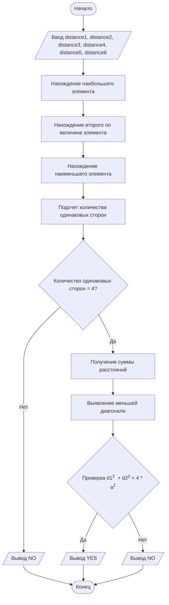

## Отчет по лабораторной работе № 1

#### № группы: `ПМ-2601`

#### Выполнил: `Гарипов Радмир Наилевич`

#### Вариант: `5`

### Cодержание:

- [Постановка задачи](#1-постановка-задачи)
- [Входные и выходные данные](#2-входные-и-выходные-данные)
- [Выбор структуры данных](#3-выбор-структуры-данных)
- [Алгоритм](#4-алгоритм)
- [Программа](#5-программа)
- [Анализ правильности решения](#6-анализ-правильности-решения)

### 1. Постановка задачи

> Программа получает на вход 6 натуральных чисел. На выходе она должна вернуть либо "YES", если эти 6 чисел могут быть расстояниями между вершинами ромба, либо "NO", если не могут.

Данную задачу можно разделить на 3 подзадачи: частично упорядочить массив и выявить сторону ромба, выделить диагонали и проверить выполнение равенства для сторон и диагоналей ромба 

- Для 1 подзадачи нужно упорядочить массив и найти элемент, который повторяется 4 раза
- Для 2 подзадачи нужно выделить диагонали из оставшихся элементов массива
- Для 3 подзадачи нужно проверить выполнение равенства d1<sup>2</sup> + d2<sup>2</sup> = 4*a<sup>2</sup>, где d1, d2 - диагонали, а a - сторона ромба

### 2. Входные и выходные данные

#### Данные на вход

На вход программа должна получать 2 числа, при этом в условии не сказано, к какому множеству
принадлежать получаемые числа, поэтому будем считать их вещественными. Также даны верхняя и нижняя границы получаемых
чисел.

|           | Тип               | min значение | max значение   |
|-----------|-------------------|--------------|----------------|
| (Число 1) | Натуральное число | 1            | 10<sup>9</sup> |
| (Число 2) | Натуральное число | 1            | 10<sup>9</sup> |
| (Число 3) | Натуральное число | 1            | 10<sup>9</sup> |
| (Число 4) | Натуральное число | 1            | 10<sup>9</sup> |
| (Число 5) | Натуральное число | 1            | 10<sup>9</sup> |
| (Число 6) | Натуральное число | 1            | 10<sup>9</sup> |


#### Данные на выход

Текстовое значения того, образуют ли расстояния вершины ромба

|         | Тип   | 1 значение | 2 значение |
|---------|-------|------------|------------|
| Вывод   | Текст | YES.       | NO         |

### 3. Выбор структуры данных

|                       | название переменной | Тип (в Java) | 
|-----------------------|---------------------|--------------|
| Число 1               | `distance1`         | `int`        |
| Число 2               | `distance2`         | `int`        |
| Число 3               | `distance3`         | `int`        |
| Число 4               | `distance4`         | `int`        |
| Число 5               | `distance5`         | `int`        |
| Число 6               | `distance6`         | `int`        |
| Временная переменная  | `temp`              | `int`        |
| Количество сторон     | `numOfSides`        | `int`        |
| Сумма всех расстояний | `sumOfDistances`    | `int`        |
| Меньшая диагональ.    | `smallerDiagonal`   | `int`        |

Для вывода результата необязательно его хранить в отдельной переменной.

### 4. Алгоритм

#### Алгоритм выполнения программы:

1. **Ввод данных:**  
   Программа считывает шесть натуральных чисел.

2. **Выявление сторон и диагоналей:**  
   Программа находит первое и второе из наибольших чисел, а так же наименьшее путем выполнения частичного упорядочивания массива. Далее бОльшая диагональ определяется как наибольший элемент массива, а меньшая представляется как разность суммы всех расстояний и суммы четырех сторон и бОльшей диагонали.
3. Проверка выполнения равенства: 
   По теореме Пифагора для того, чтобы два числа d1 и d2, соответствующие диагоналям четырехугольника, и 4 стороны a образовывали ромб, необходимо выполнение равенства (d1/2)<sup>2</sup>  + (d2/2)<sup>2</sup> = a<sup>2</sup>. Если домножить левую и правую часть на 4, то мы получим: d1<sup>2</sup>  + d2<sup>2</sup> = 4 * a<sup>2</sup>

4. **Вывод результата:**  
   При выполнении всех условий на экран выводится "YES", если хотя бы одно условие не выполняется, то на экран выводится "NO".

#### Блок-схема



### 5. Программа

```java
import java.util.Arrays;  
import java.util.Scanner; 
  
public class Main {  
    public static void main(String[] args){  
        Scanner in = new Scanner(System.in);  
        //вводим расстояния между точками  
        int distance1 = in.nextInt();  
        int distance2 = in.nextInt();  
        int distance3 = in.nextInt();  
        int distance4 = in.nextInt();  
        int distance5 = in.nextInt();  
        int distance6 = in.nextInt();  
  
        //найдем большее из расстояний путем сортировки с помощью большого количества сравнений переменных  
        //заметим, что для того, чтобы из любого массива переменных выявить диагонали необходимо выявить 2 больших        //и один меньший элемент        //сначала находим больший        if (distance1 > distance2){int tmp = distance1; distance1 = distance2; distance2 = tmp;}  
        if (distance2 > distance3){int tmp = distance2; distance2 = distance3; distance3 = tmp;}  
        if (distance3 > distance4){int tmp = distance3; distance3 = distance4; distance4 = tmp;}  
        if (distance4 > distance5){int tmp = distance4; distance4 = distance5; distance5 = tmp;}  
        if (distance5 > distance6){int tmp = distance5; distance5 = distance6; distance6 = tmp;}  
        //затем второй наибольший  
        if (distance1 > distance2){int tmp = distance1; distance1 = distance2; distance2 = tmp;}  
        if (distance2 > distance3){int tmp = distance2; distance2 = distance3; distance3 = tmp;}  
        if (distance3 > distance4){int tmp = distance3; distance3 = distance4; distance4 = tmp;}  
        if (distance4 > distance5){int tmp = distance4; distance4 = distance5; distance5 = tmp;}  
        //затем наименьший  
        if (distance4 < distance3){int tmp = distance3; distance3 = distance4; distance4 = tmp;}  
        if (distance3 < distance2){int tmp = distance2; distance2 = distance3; distance3 = tmp;}  
        if (distance2 < distance1){int tmp = distance1; distance1 = distance2; distance2 = tmp;}  
        //Теперь distance1 - гарантированно меньший из элементов массива, distance5 и distance6 - наибольшие;  
        //А distance2 - гарантироанно элемент, который соответствует одной из сторон ромба        //найдем количество повторений элемента, соответствующего стороне ромба (второй элемент уже подсчитан)        int numOfSides = 1;  
        if (distance1 == distance2){numOfSides++;}  
        if (distance3 == distance2){numOfSides++;}  
        if (distance4 == distance2){numOfSides++;}  
        if (distance5 == distance2){numOfSides++;}  
        //проверяем, повторяется ли ребро 4 раза (в ромбе все стороны равны, диагональ гарантированно не может быть  
        // равна стороне т.к. все расстояния - натуральные числа)        if (numOfSides == 4){  
            //одна из диагоналей гарантированно больше, чем любое ребро (наибольший элемент последовательности)  
            //вторую диагональ можно найти, если вычти из суммы всех расстояний бОльшую диагональ и все 4 ребра, так как            //она может лиюо быть больше рёбер, либо быть меньше рёбер            //найдем сумму всех расстояний            int sumOfDistances = distance1 + distance2 + distance3 + distance4 + distance5 + distance6;  
            //находим меньшую диагональ  
            int smallerDiagonal = sumOfDistances - 4*distance2 - distance6;  
            //проверяем равенство d1^2 + d2^2 = 4*a^2 и выводим ответ  
            if (distance6*distance6 + smallerDiagonal*smallerDiagonal == 4 * distance2*distance2){  
                System.out.println("YES");  
            } else {  
                System.out.println("NO");  
            }  
        } else {  
            System.out.println("NO");  
        }  
    }  
}
```

### 6. Анализ правильности решения
Для тестов возьмeм несколько произвольных массивов, а так же массивы [5, 5, 5, 5, 6, 8] и [10, 13, 13, 13, 13, 24], в том числе перемешанные варианты этих массивов. 
1. Тест на обработку упорядоченного массива, значения в котором соответствуют расстояниям между вершинами ромба
	-**Input**
	5 5 5 5 6 8
	-**Output**
	"YES"
	-**Input**
	10 13 13 13 13 24
	-**Output**
	"YES"
2. Массивы как в первом примере, но массивы не упорядочены
	-**Input**
	5 6 5 8 5 5
	-**Output**
	"YES"
	-**Input**
	8 6 5 5 5 5
	-**Output**
	"YES"
	-**Input**
	13 24 13 10 13 13
	-**Output**
	"YES"
	-**Input**
	24 13 13 13 13 10
	-**Output**
	"YES"
3. Некоторые случайные последовательности
	-**Input**
	1 2 3 4 5 6
	-**Output**
	"NO"
	-**Input**
	5 5 5 6 6 8
	-**Output**
	"NO"
	-**Input**
	5 5 5 5 6 9
	-**Output**
	"NO"
#### Все тесты были пройдены успешно => программу можно считать рабочей.
